# Introduction to Cloud Computing – Security & Identity Management (IAM)

## Importance of IAM for Zappy e-Bank

Identity and Access Management (IAM) plays a vital role in securing cloud environments by controlling who can access what resources. For Zappy e-Bank, implementing strong IAM practices helps ensure:

- Enhanced security posture  
- Least privilege access  
- Secure identity lifecycle management

---

## 📊 IAM Dashboard

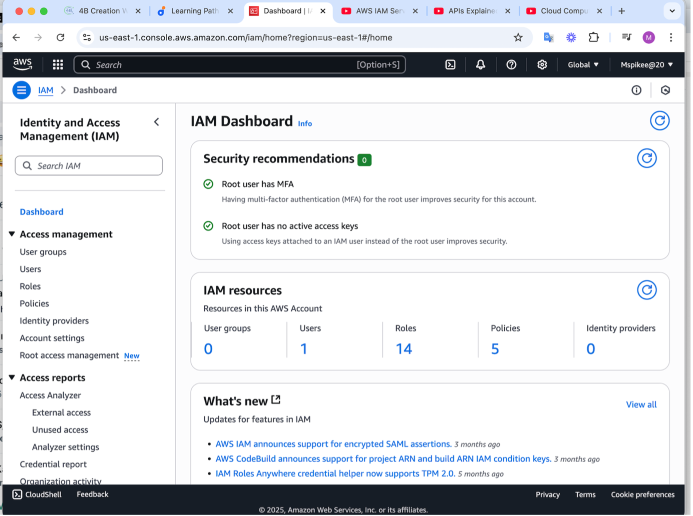

---

## 👥 Create User – John (Backend Developer)

---

## 👥 Create User – Mary (Data Analyst)

---

## 👥 Create User Group

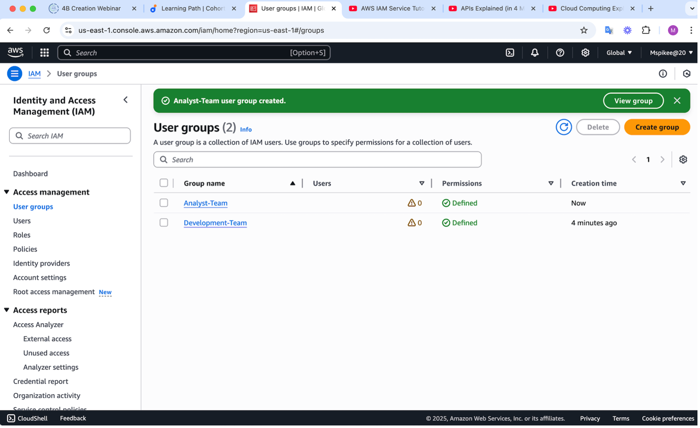

---

## 👥 Create Development Team Group

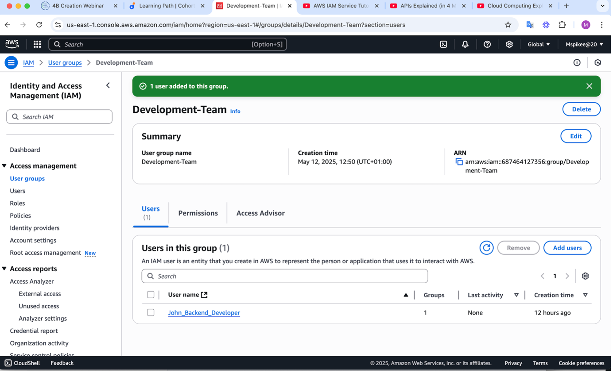

---

## 🛡️ Policy Permissions

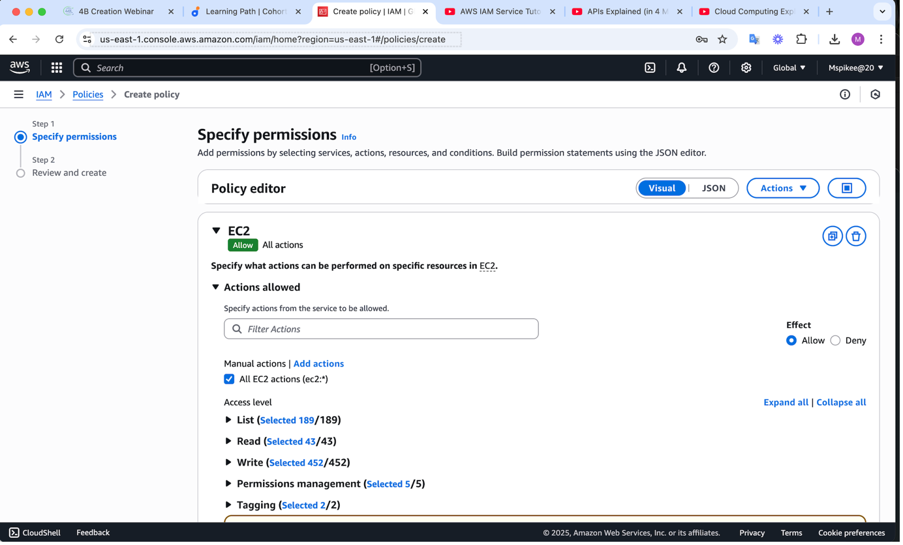

---

## ✅ Confirm Developer Policy

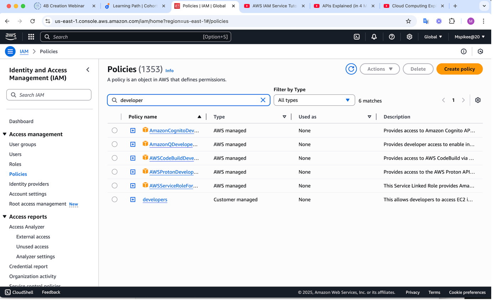

---

## ✅ Confirm Analyst Policy

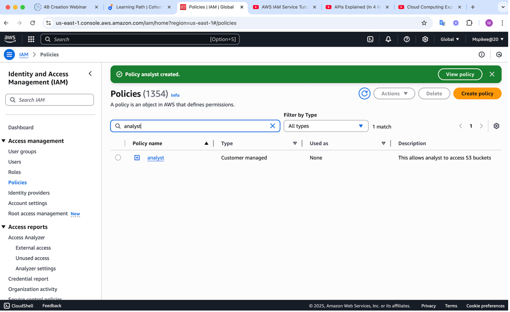

---

## 🔐 Log into AWS Console – John

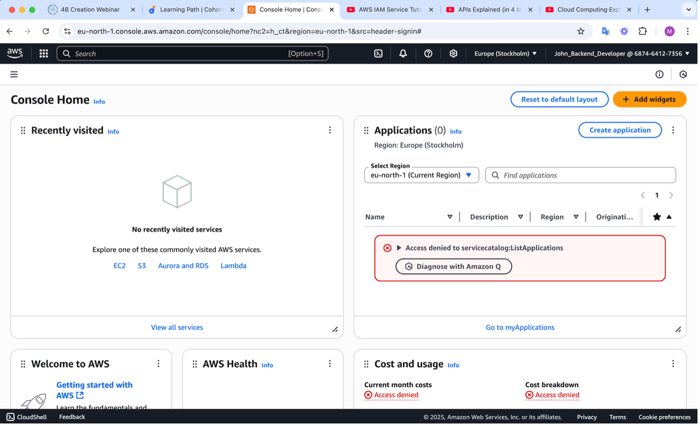

---

## 🖥️ Launch EC2 Instance – John

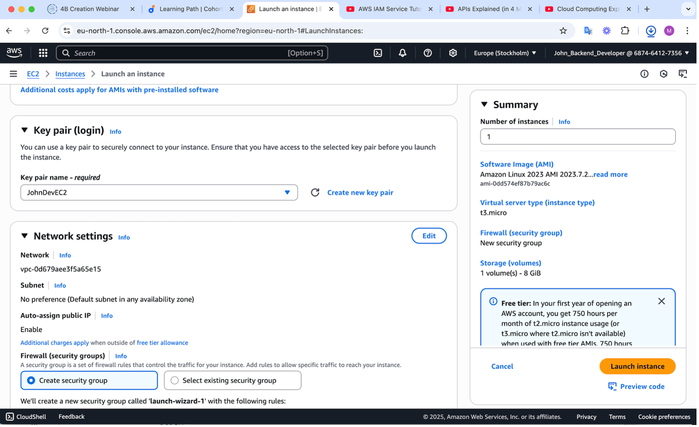

---

## 🗂️ Create S3 Bucket – Mary

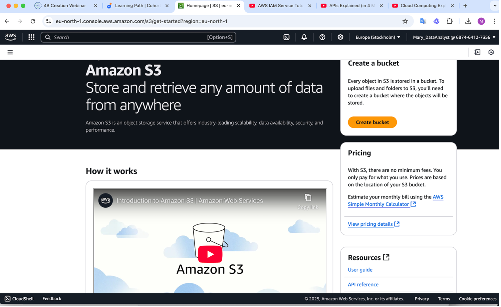

---

## 🔐 Enable MFA – John

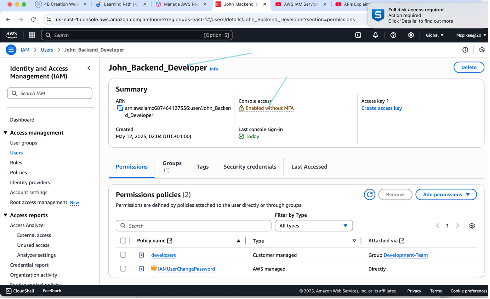

---

## 📱 App Authenticator – John

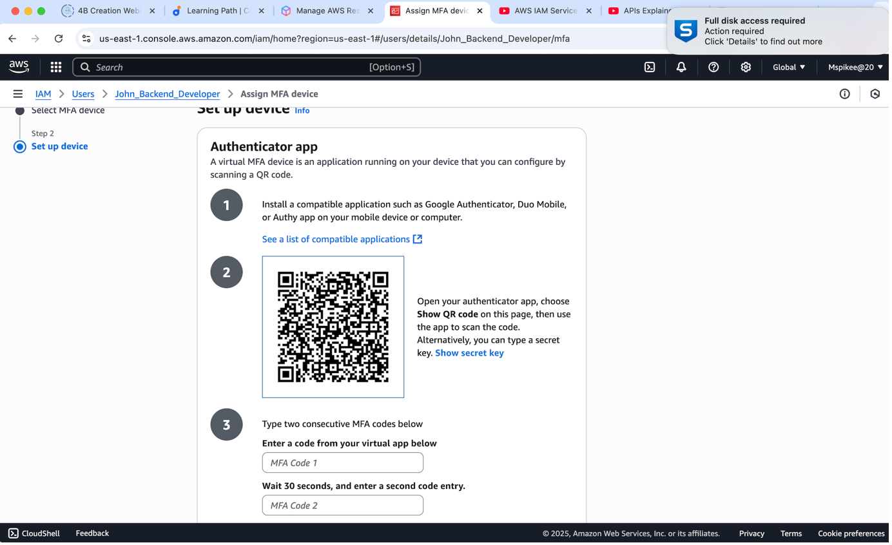

---

## 🔐 Enable MFA – Mary

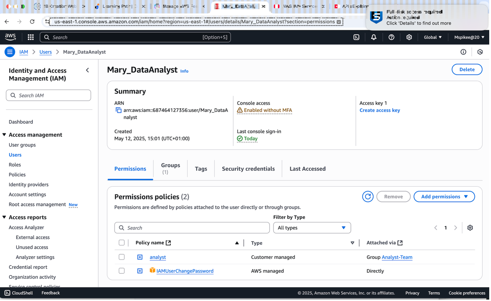

---

## ✅ MFA Enabled – Mary

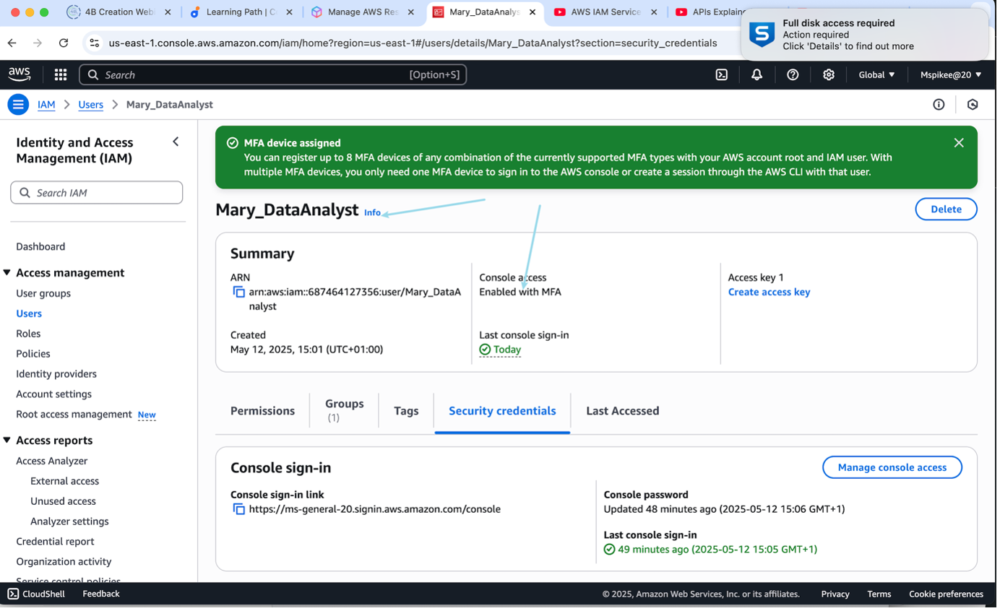

---

## 📱 App Authenticator – Mary

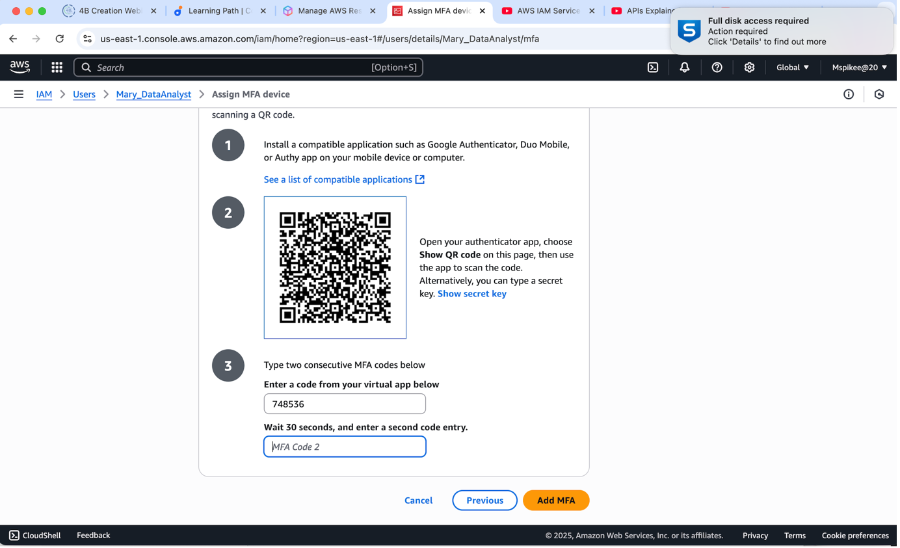

